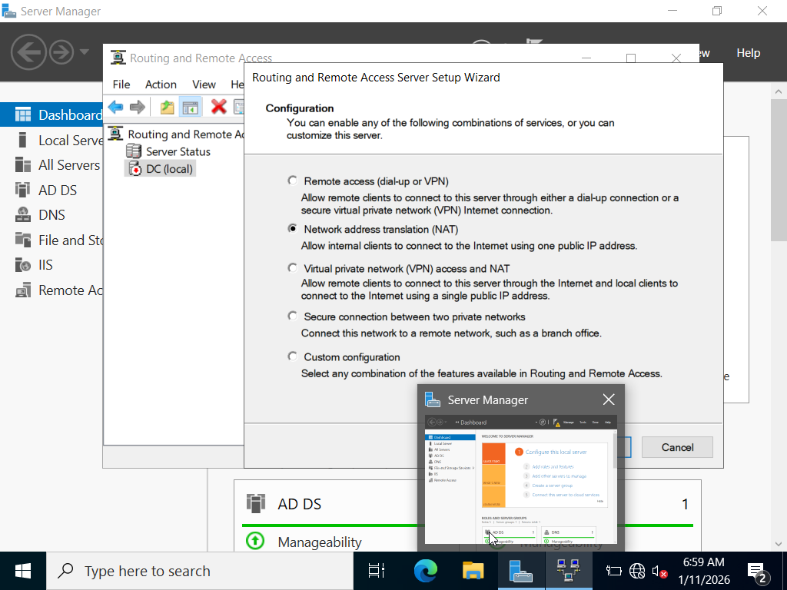

# NAT Configuration (RRAS)

## Install Routing and Remote Access Services
- Server Manager
- Add features and rloe
- Choose Remote Access Services

## NAT Configuration
- NAT enabled on the external (Internet-facing) interface

## Purpose
- Allow domain clients to access external networks(Intenet)

## Screenshot

