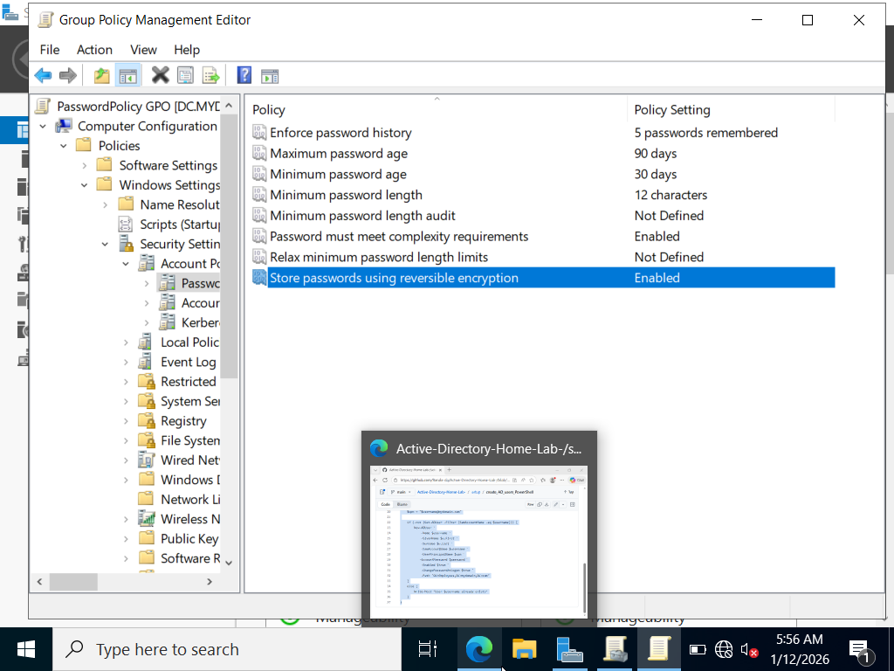

# GPO Password Policy Configuration

## Configuration Path
Computer Configuration →  
Policies →  
Windows Settings →  
Security Settings →  
Account Policies →  
Password Policy

## Configured Settings
- Enforce password history: 5 passwords remembered 
- Maximum password age: 90 days 
- Minimum password age: 30 days 
- Minimum password length: 12 characters 
- Password must meet complexity requirements: Enabled 
- Store passwords using reversible encryption: Enabled

## Screenshot

